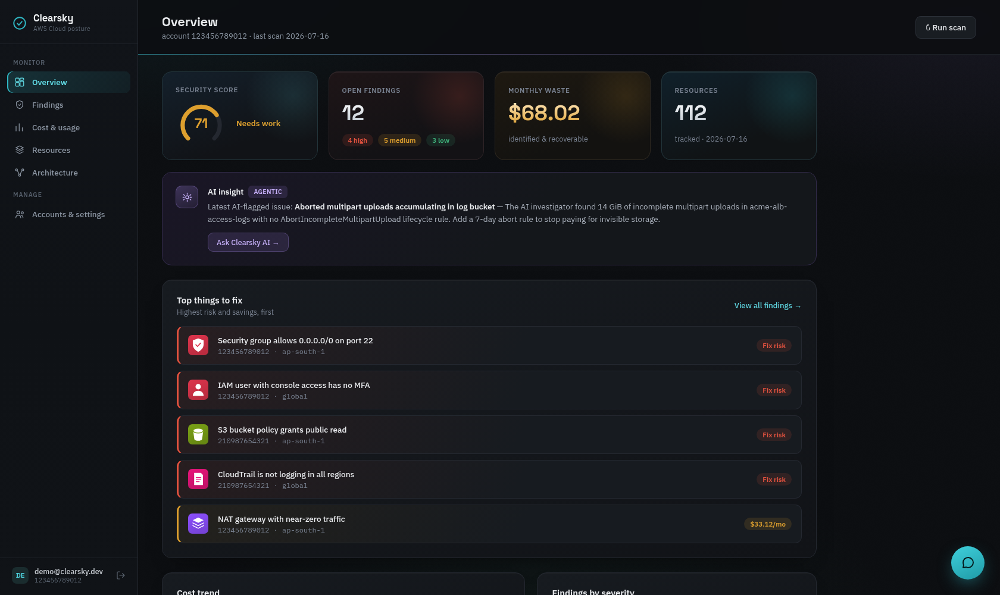
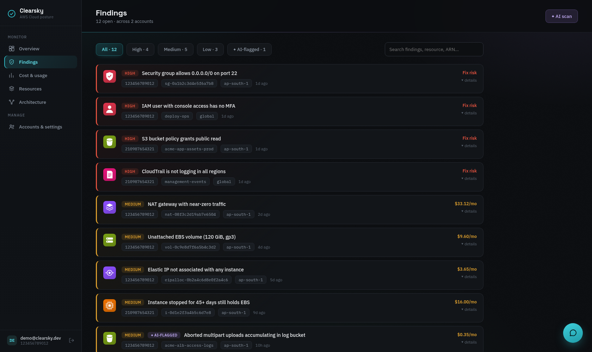
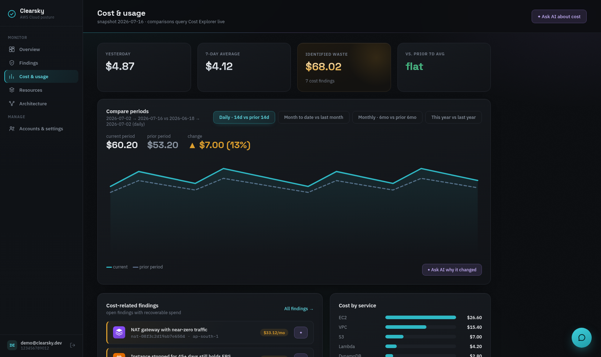
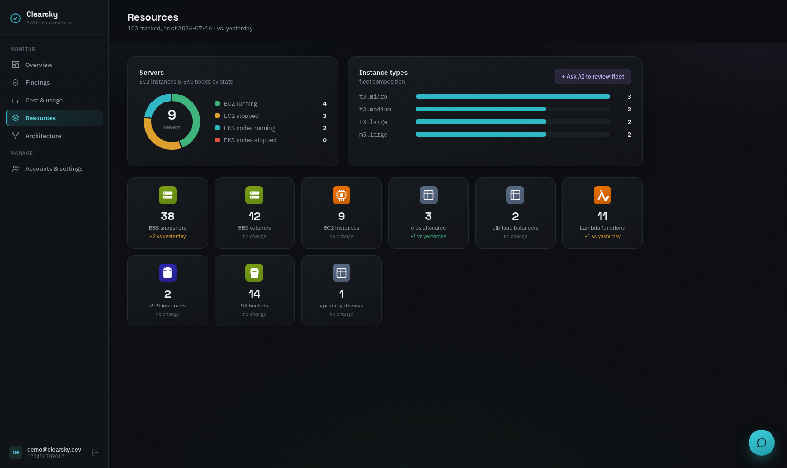
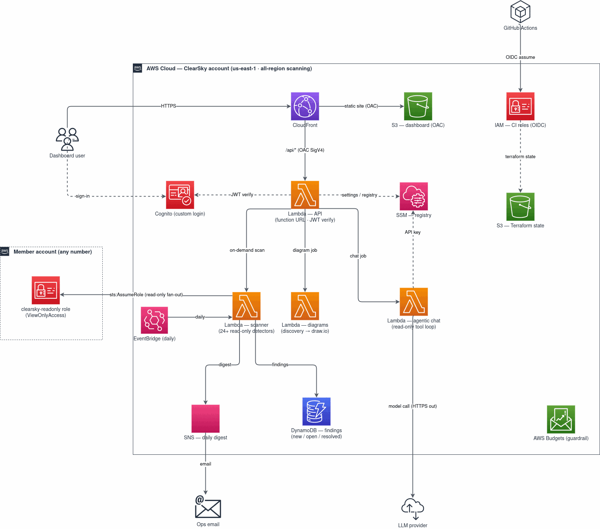

# Clearsky

Know what's running. Know what it costs.

Serverless AWS security-posture, cost, and inventory platform with an
agentic AI investigator and an architecture-diagram generator — deployed
as a static multipage dashboard (CloudFront + S3) over a zero-dependency
Python Lambda backend.

## Dashboard

*Screenshots show the dashboard with demo data.*

| Cost & usage | Resources |
| --- | --- |
|  |  |

## Architecture

- **Dashboard**: multipage static site in `web/`, served from a private S3
  bucket through CloudFront (OAC). Pretty URLs via a CloudFront Function.
- **Auth**: Cognito user pool, custom login page (`USER_PASSWORD_AUTH` via
  the Cognito API — no hosted UI). The API Lambda re-verifies every JWT
  in-process (`src/clearsky/authn.py`, pure-stdlib RS256).
- **API**: one Lambda behind a function URL, reachable only through
  CloudFront (`/api/*` behavior + OAC SigV4).
- **Engine**: scanner (24+ detectors, daily schedule), agentic chat,
  architecture generator — `src/clearsky/`, stdlib+boto3 only.
- **Multi-account**: onboard member accounts from the dashboard
  (assume-role registry in SSM; `terraform/member-role` creates the
  target-account role).

## Cost profile

Every component is pay-per-use (CloudFront, Lambda, Cognito, DynamoDB
on-demand, S3); idle cost is effectively zero and a budget guardrail
alerts on drift.

## Deploy

1. `terraform/bootstrap` (local, once): state bucket + GitHub OIDC CI roles.
2. Set repo secrets `AWS_PLAN_ROLE_ARN`, `AWS_APPLY_ROLE_ARN`,
   `TF_STATE_BUCKET`, `ALERT_EMAIL`.
3. Push to `main` — GitHub Actions applies terraform, bakes `config.js`,
   syncs `web/` to S3, invalidates CloudFront.
4. Create a login: `terraform output create_dashboard_user_command`.
5. Custom domain (optional): add the ACM validation CNAME + a
   `clearsky` CNAME to the CloudFront domain in Cloudflare, then set
   `enable_custom_domain = true` and push.
